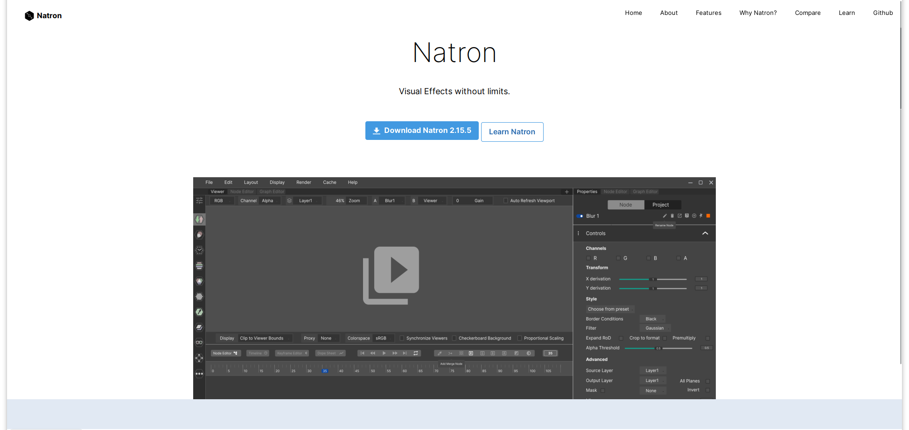

<<<<<<< HEAD
# Natron Website - UI/UX Design 
 Collaborative repo for those interested in improving/modifying Natron's UI/UX. 
=======
# Natron - UI/UX Design (Website Branch)
 Collaborative repo for those interested in improving/modifying Natron's Website's UI/UX. 
>>>>>>> 6989e9a9c0e66a3d1e667695116a0d06923e261e

## Welcome!
This is a repository for anyone interested in UI/UX design to work together on improving [Natron's GUI](https://github.com/NatronGitHub/Natron). Feel free to discuss UI issues, come up with new designs, or showcase your own designs of Natron.

## Designs

Here is the current design of the Natron UI/UX Design Project:

### Latest Design 

**Version 1.0**

<<<<<<< HEAD

=======
>>>>>>> 6989e9a9c0e66a3d1e667695116a0d06923e261e

## Contributing
There are many ways to contribute to this project:
- Suggesting a UI/UX feature
- Creating UI/UX mockups
- Adding to the documentation of this repo
- (Politely) giving criticism of other's designs

## Code of Conduct
See [code of conduct]

 [code of conduct]: https://github.com/Songtech-0912/natron-ui-ux-design/docs/code-of-conduct.md
 
