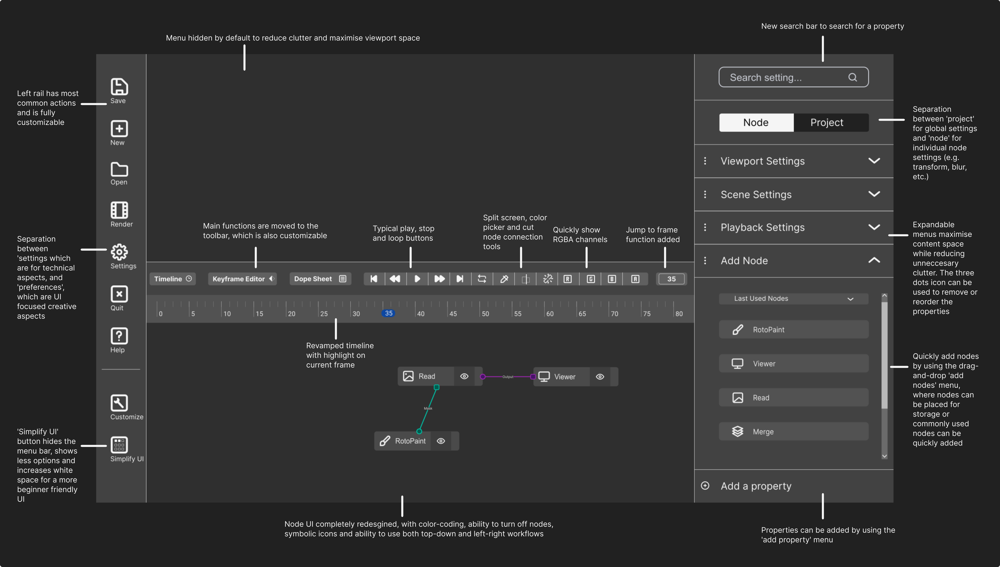

# UPDATE: Natron UI Redesign 2.0

A revamp of my original design for, based on the feedback I received.

## Overview

After receiving the wonderful feedback all of you gave me, I decided to redesign my concept. Here is an annotated version of my new design:

I also tried to improve the less-than-ideal UX of the previous design. Here are some new UX-focused features I added:

**Drag & Drop:**

**Accordion Menus:**

**Show/Hide Top menu with Simplify UI:**

*(Interestingly enough this was actually animated with Natron)*

I tried to address the issues many of you pointed out, including these:

* **Material design bloat:** I used a less distracting dark theme, and only used accent colors for elements that need distinguishing

* **No option for top-down workflow:** I reworked the node design to make better use of space and work in a top-down view

* **Low Information Density:** I added a toggle in the sidebar called 'simplify UI' to change between the default mode and a 'work' mode for focused, long duration projects. However, the functionality is still in its early stages, and the work mode hasn't been finished.

* **Not optimized for professionals:** I've maximized viewport size by hiding the top menu bar by default and moving most functions to the left rail. Once complete, the work mode also should look more professional, and I plan on integrating shortcuts to make everything even faster.

* **Node Color Scheme Lacking:** Though unfortunately I haven't been able to solve this issue, I have improved the look and organization of the nodes and of their connection lines to look cleaner.

* **Bad Sliders:** I'm preparing to change most color/pixel data sliders to a logarithmic scale (for 3.0, not yet) and also add number input fields next to every slider (for precision input) in the next release.

* **Too much padding:** I know it is a problem, but I haven't been able to solve this one without also making the design too cramped. If any of you has a better idea, please reply!

## New Logo Idea

I've also designed a new logo for Natron out of the frustration of the complexity of the current logo. I tried to make my logo design minimalist by using only three shapes: squares, circles, and hexagons. Here it is:

It's designed to symbolized both the node-based compositing capability of Natron, and also the community that Natron is made by. (Whether if people will think of that is another question).

Tell me what you think of it!

## Future

I am already working on the next version (3.0), which will feature more improvements to the UX, light theme support, and completion of the UI "mode switching" function. I will also be redesigning Natron's website, which has OK UI but (in my opinion only) is lacking in the UX department.

One caveat though: working on the next release will take a long time if I do it alone, and I will need the community's support if I'm going to be working on this outside of freetime and late hours. 

If any of you have suggestions or are interested, please regularly visit this project's Github repo and contribute. I've also hosted the Inkscape SVG files for the design on this github repo. You can find them in the `SVG` folder.