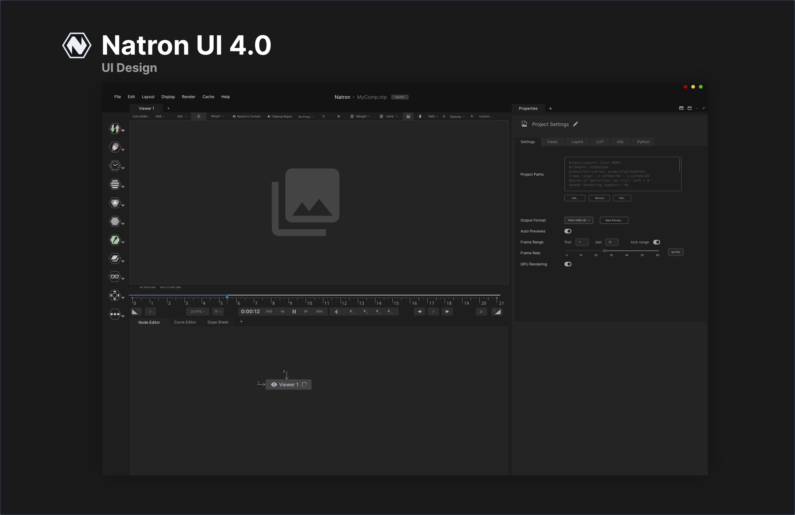

# Natron UI/UX Project Version 4.0 Release

After half a year of work, I've finished work on the 4.0 design for the Natron UI/UX redesign. Here are the results:

## Application GUI

### Release Notes

With a philosophy of sticking with Natron's current look and feel, I designed this UI to accomplish the following goals:

* Redesign tabs so as not to distract attention away from the key components (viewer, node tree and properties)
* Maximize size of viewport by moving viewport controls to a convenient top menu
* Streamline panels, including typeface, type size, and structuring
* Updated node designs to better accommodate existing Natron users and added the spinners to indicate load speed
* Clean up Natron's existing color palette for a consistent layout and a stronger sense of visual hierarchy
* Standardize buttons, dropdowns, and text for a more visual appealing interface

Please submit feedback for this design (or ask me questions) by sending me [an email](jacky.song1020@gmail.com)

## Website

### Release Notes

Natron deserves to have a nice-looking website to complement its powerful capabilities. Here are some highlights form my design:

* Use of bold text for the hero, allowing the viewer to stay focused
* Modern centered layout, allowing for a cleaner presentation
* Gradients and shadows, which complement the main elements and can be used for emphasis